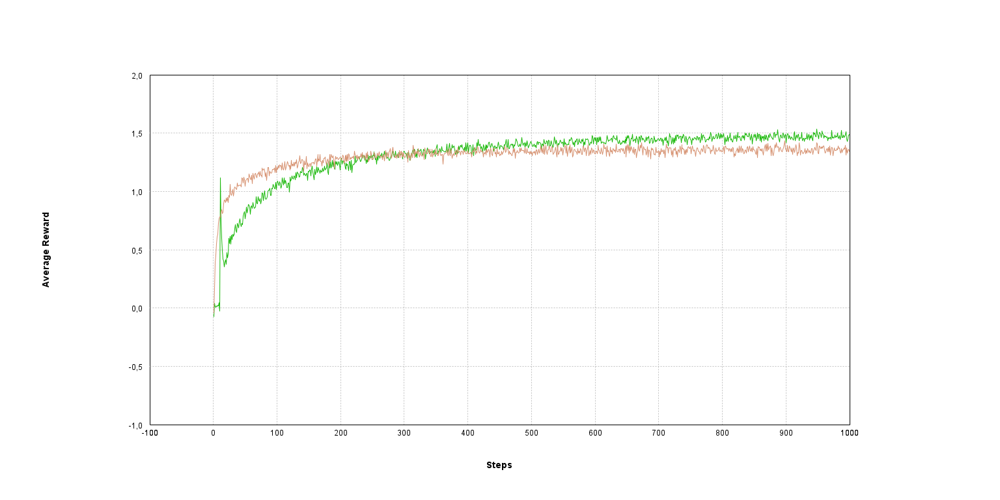

# Multi-Armed Bandits Problem

This library implements the multi-armed bandits problem as described in the book [Reinforcement Learning](https://mitpress.mit.edu/books/reinforcement-learning-second-edition) By Richard S. Sutton and Andrew G. Barto.

It allows to run test bed using multiple action policies and to compare the learning results by using raw json data or visually by plotting the mean average rewards for each action policy (see the [Usage](#usage) section).

Epsilon-greedy and Upper Confidence Bounds policies are the two available policies at the moment, Gradient Bandit Algorithms will be implemented in a near future. 


## Usage

Use Command Line Interface usage: ```mvn <jar file> <option>```

- ```--help``` will return the list of options available
```bash
java -jar .\target\bandit-problem-*.jar --help
```
```
usage: mvn <jar file> <option>
----
 List of options available :
----
 -h,--help                  show this message
 -p,--plot                  plot mean average results after bedtest
 -t,--testbed <file path>   absolute path for input json file used as
                            bandit problem test bed configuration
----
```

- Run a testbed and plot the results ```java -jar .\target\bandit-problem-1.0.0-SNAPSHOT.jar --testbed  <file path> --plot```

    - The file provided as input is a json file used as configuration for a testbed. It should look like this :
```json
{
  "policies" : [ 
    {
    "name" : "E_GREEDY",
    "epsilon" : 0.1
    },
    {
    "name" : "UCB",
    "c" : 2
    }
  ],
  "banditProblemCount" : 2000,
  "k" : 10,
  "totalSteps" : 1000
}
```

- ```policies``` an array of policies with their specific parameters. Add as many policies you want in the json array, policy names are available in [ActionPolicyNames](/src/main/java/org/gagneray/rl/banditproblem/actionSelectionPolicies/ActionPolicyNames.java) enum.
- ```banditProblemCount``` represents the number of bandit problem generated for each policy
- ```k```  is the number of bandit generated for each bandit problem.
- ```totalSteps``` is the number of time step for each bandit problem. On each step, a selected bandit performs an action.  

As an example, use the provided json configuration file with this command :
```java -jar .\target\bandit-problem-1.0.0-SNAPSHOT.jar --testbed .\src\main\resources\configs\testbed_config_1.json --plot```

It will run a testbed according to the configuration file and display a resulting graph like this one : 



## License
[MIT](https://choosealicense.com/licenses/mit/)